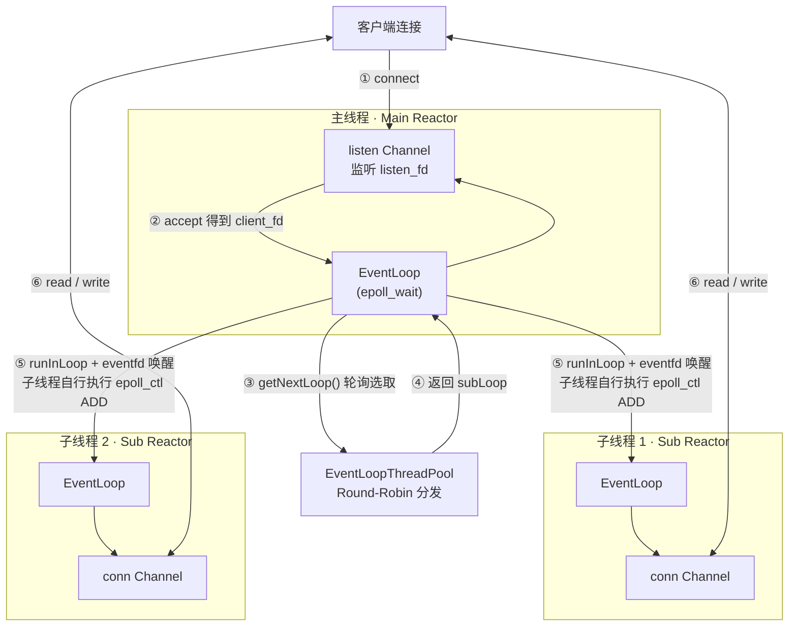

# C++ 多 Reactor 高并发网络框架（One Loop Per Thread）

> 基于 C++17 + epoll 的事件驱动 TCP 服务器，从单线程阻塞 Echo 演进到主从多 Reactor 架构，
> 支持跨线程任务投递、连接生命周期自动管理，并附自研压测客户端的完整性能对比。

---

## ✨ 特性

- **主从 Reactor 模型**：主线程专职 `accept`，子线程池分摊连接读写，充分利用多核
- **One Loop Per Thread**：每个子线程持有独立 `EventLoop` + `epoll` 实例，连接的 IO 路径由所属线程单线程闭环，无锁竞争
- **跨线程任务投递**：基于 `eventfd` 唤醒 + `runInLoop`，安全完成跨线程 `epoll_ctl`
- **连接生命周期自动管理**：`shared_ptr` + `closeCallback` 机制，杜绝内存泄漏与野指针
- **优雅退出**：`sigaction` 捕获 `SIGINT`，所有线程安全停止
- **可配置退化**：`threadNum = 0` 时自动退化为单 Reactor，便于横向对比

---

## 🏗️ 架构设计



**数据流说明**：

1. 客户端发起连接，主线程 `listen Channel` 触发可读事件
2. `TcpServer::handleAccept()` 调用 `accept()` 获取 `client_fd`
3. 通过 `EventLoopThreadPool::getNextLoop()` 轮询选取一个子 `EventLoop`
4. 创建 `TcpConnection`，与选中的子 `EventLoop` 绑定
5. 调用 `conn->connectEstablished()`，内部经 `runInLoop` 把"注册 Channel"任务投递到子线程，由子线程自己执行 `epoll_ctl ADD`（**绝不跨线程直接调 `epoll_ctl`**）
6. 此后该连接的读写事件完全由所属子线程处理

---

## 🎯 核心设计

### 1. One Loop Per Thread

**问题**：单 Reactor 下，所有连接的 `accept` / `read` / `write` 都挤在主线程。并发升高时，主线程遍历就绪事件的开销成为瓶颈，无法利用多核。

**方案**：每个子线程绑定一个独立的 `EventLoop`（内含独立 `epoll` 实例）。主线程只负责 `accept`，新连接按 Round-Robin 分配给子线程，后续 IO 全部在子线程内闭环完成，线程间无共享可变状态，无需加锁。

`EventLoopThread` 通过 `condition_variable` 保证主线程在拿到子线程 `EventLoop` 指针前，子线程已完成其构造，避免竞态。

### 2. eventfd 跨线程唤醒（runInLoop）

**问题**：主线程拿到子线程的 `EventLoop` 后，不能直接调用其 `epoll_ctl`（`epoll_ctl` 非线程安全，且子线程可能正阻塞在 `epoll_wait`）。

**方案**：每个 `EventLoop` 持有一个 `eventfd` 并注册进自己的 `epoll`。

```cpp
void EventLoop::runInLoop(std::function<void()> cb) {
    if (isInLoopThread()) cb();          // 已在目标线程，直接执行
    else queueInLoop(std::move(cb));     // 否则入队 + 唤醒
}

void EventLoop::queueInLoop(std::function<void()> cb) {
    { std::lock_guard<std::mutex> lock(mutex_);
      pendingFunctors_.push_back(std::move(cb)); }
    wakeup();                            // 向 eventfd 写 8 字节
}
```

`wakeup()` 向 `eventfd` 写入 8 字节，内核触发其可读事件，使阻塞在 `epoll_wait` 的目标线程立即返回，随后执行 `doPendingFunctors()` 消费任务队列。相比 `pipe`/`socketpair`，`eventfd` 只占 1 个 fd 且内核仅维护一个计数器，开销更低。

### 3. closeCallback 生命周期管理

**问题**：`TcpConnection::handleClose` 若只移除 `Channel`，对象仍留在 `TcpServer::connections_` 中，`shared_ptr` 引用计数永不归零 → 内存泄漏；反之若先销毁对象再移除 `Channel`，则子线程访问已释放内存 → 段错误。

**方案**：

- `Channel` 所有权下沉到 `TcpConnection`（方案 B），生命周期与连接绑定
- `TcpConnection` 继承 `enable_shared_from_this`，跨线程回调一律传 `shared_from_this()` 而非裸 `this`，保证回调执行期间对象存活
- `TcpServer` 创建连接时把 `removeConnection` 绑定为 `closeCallback`；`handleClose` 末尾触发该回调，通知主线程从 `connections_` 中 `erase`，引用计数归零后安全析构

```cpp
void TcpConnection::handleClose() {
    setState(kDisconnected);
    channel_->disableAll();
    loop_->removeChannel(channel_.get());
    if (closeCallback_) closeCallback_(shared_from_this());  // 通知 TcpServer 清理
}
```

---

## 📁 项目结构

```
.
├── src/                              # 多 Reactor 核心框架
│   ├── Channel.h / .cpp              # 事件分发：fd + 事件 + 回调绑定
│   ├── Epoll.h / .cpp                # 封装 epoll_create1 / ctl / wait
│   ├── EventLoop.h / .cpp            # 事件循环 + eventfd 跨线程唤醒
│   ├── EventLoopThread.h / .cpp      # 一线程一 EventLoop，同步启动
│   ├── EventLoopThreadPool.h / .cpp  # 子 Reactor 池，Round-Robin 分发
│   ├── TcpConnection.h / .cpp        # 连接生命周期 + 缓冲区 + 读写
│   ├── TcpServer.h / .cpp            # accept + 连接分发 + 清理
│   └── test_reactor_server.cpp       # 服务器入口（支持 SIGINT 优雅退出）
├── tools/
│   └── load_test_client.cpp          # 自研压测客户端（thread-per-connection）
├── tests/
│   └── test_eventloop_thread.cpp     # EventLoopThread 跨线程投递测试
├── legacy/                           # 演进历史代码（未整理，供对照参考）
│   ├── echo_server.cpp               # 阶段 1：单线程阻塞 Echo
│   ├── echo_server_fork.cpp          # 阶段 2：多进程并发
│   ├── echo_server_pthread.cpp       # 阶段 2：多线程并发
│   ├── epoll_server_skel.cpp         # 阶段 3：epoll 最小骨架
│   ├── epoll_server_lt.cpp           # 阶段 3：LT 模式 Echo
│   ├── epoll_server_et.cpp           # 阶段 3：ET 模式改造
│   ├── epoll_server_buffer.cpp       # 阶段 3：输出缓冲区 + EPOLLOUT
│   └── ThreadPool.h / .cpp           # 阶段 4：通用线程池（支持 std::future）
└── README.md
```

---

## 📊 性能压测

### 测试环境

| 项 | 值 |
| :--- | :--- |
| 环境 | Ubuntu 24.04 虚拟机，**2 CPU 核心** |
| 编译 | `g++ -std=c++17 -O2 -pthread` |
| 模型 | 纯 Echo，消息大小 100 字节，无业务线程池 |
| 客户端 | 自研 `load_test_client`，thread-per-connection 阻塞模型 |
| 部署 | **客户端与服务器同机运行** |
| 方法 | 每组并发跑 3 次取平均，每次 30 秒 |

> **对比口径说明**：表中"单 Reactor"与"多 Reactor"为**同一份代码**，仅 `threadNum` 参数不同（0 / 2 / 4），业务逻辑均为纯 Echo、不挂业务线程池，保证对比变量唯一。注意这与阶段 4 中带业务线程池的原始单 Reactor 版本不同。

### 结果（3 次平均）

| 并发 | 模型 | QPS | Avg(ms) | P50(ms) | P99(ms) | 吞吐(MB/s) | 错误率 |
| :--- | :--- | ---: | ---: | ---: | ---: | ---: | ---: |
| 100 | 单 Reactor | 38977 | 2.57 | 2.26 | 4.71 | 7.43 | 0% |
| 100 | 多 Reactor (4) | 54631 | 1.83 | 1.52 | 6.81 | 10.42 | 0% |
| 500 | 单 Reactor | 36665 | 13.71 | 12.23 | 21.98 | 6.99 | 0% |
| 500 | 多 Reactor (4) | 45018 | 11.17 | 8.52 | 43.12 | 8.59 | 0% |
| 1000 | 单 Reactor | 35313 | 28.46 | 26.76 | 46.49 | 6.74 | 0% |
| 1000 | 多 Reactor (4) | 42370 | 23.80 | 19.33 | 79.26 | 8.08 | 0% |
| 1000 | 多 Reactor (2) | **44753** | **22.50** | **18.39** | 67.67 | **8.54** | 0% |

**多 Reactor (4) 相对单 Reactor 的提升**：

| 并发 | QPS | Avg 延迟 | P50 | P99 |
| :--- | ---: | ---: | ---: | ---: |
| 100 | **+40.2%** | −28.8% | −32.7% | +44.6%（变差） |
| 500 | **+22.8%** | −18.5% | −30.3% | +96.2%（变差） |
| 1000 | **+20.0%** | −16.4% | −27.8% | +70.5%（变差） |

### 数据分析与调优过程

**现象 1：多 Reactor QPS 全面领先，但优势随并发收窄（+40% → +20%）**

用 `mpstat` 观察压测期间 CPU 分布：`%soft` 高达 **57%**，`%sys` 33.5%，`%usr` 仅 9.5%。说明瓶颈在**内核网络协议栈**（处理海量小包的软中断），而非应用层 Reactor 代码。并发越高、包越多，`%soft` 占比越大，多线程的优势被稀释。

**现象 2：单 Reactor QPS 几乎不随并发衰减（39000 → 35300，仅降 9%）**

应用层用户态开销本就只占 9.5%，真正的吞吐上限由内核协议栈和系统调用决定，与线程模型无关。

**现象 3：P99 倒挂——多 Reactor 尾部延迟反而更差**

本机仅 **2 核**，却开了 4 个子线程 + 1 主线程 = 5 个服务器线程，叠加 **1000 个客户端线程**，共 1005 个线程抢 2 个核心，严重超配。P99 捕捉的正是某个子线程被海量客户端线程抢占、长时间得不到 CPU 时间片的瞬间。单 Reactor 服务器线程最少，调度竞争最小，故 P99 反而更优。

**调优验证**：将 `threadNum` 从 4 降为 2（匹配核心数），1000 并发下 **QPS +5.6%，P99 −14.6%**（79.26 → 67.67 ms），验证了"线程数应与 CPU 核心数匹配、避免超配"的判断。

> **结论**：本压测环境下，QPS 与平均延迟稳定证明多 Reactor 的优势；P99 倒挂是同机部署 + 阻塞式客户端 + 2 核超配导致的环境偏差，非架构缺陷。改进方向：双机压测、`threadNum` 对齐核心数、客户端改用 epoll 模型。

---

## 🚀 编译与运行

### 依赖

- Linux（Ubuntu 20.04+），g++ 支持 C++17
- 无第三方库依赖，仅标准库 + POSIX API

### 方式一：g++ 直接编译

```bash
g++ -std=c++17 -O2 -pthread -Isrc \
    src/test_reactor_server.cpp src/TcpServer.cpp src/TcpConnection.cpp \
    src/EventLoopThreadPool.cpp src/EventLoopThread.cpp \
    src/EventLoop.cpp src/Epoll.cpp src/Channel.cpp \
    -o test_reactor_server
```

### 运行服务器

```bash
./test_reactor_server 4    # 4 个子 Reactor（多 Reactor 模式）
./test_reactor_server 2    # 2 个子 Reactor（匹配 2 核机器）
./test_reactor_server 0    # 0 个子 Reactor（退化为单 Reactor）
```

按 `Ctrl+C` 优雅退出，主线程 + 各子线程依次打印 `EventLoop stopped.`。

### 编译并运行压测客户端

```bash
g++ -std=c++17 -O2 -Wall -pthread tools/load_test_client.cpp -o load_test_client

# 用法：./load_test_client [并发数] [时长秒] [消息字节数]，默认 100 30 100
./load_test_client 1000 30 100
```
### 方式二：CMake 构建

```bash
mkdir -p build && cd build
cmake -DCMAKE_BUILD_TYPE=Release ..
make -j$(nproc)
cd ..

./build/test_reactor_server 4              # 运行服务器
./build/load_test_client 1000 30 100       # 运行压测客户端
```

### 功能验证

```bash
# 另开终端
telnet 127.0.0.1 8888    # 或 nc 127.0.0.1 8888
# 输入任意字符，服务器原样回显
```

### 演进历史代码（可选）

`legacy/` 下每个文件均可独立编译运行，用于对照各阶段实现：

```bash
g++ -std=c++17 legacy/echo_server.cpp -o echo_server          # 阶段 1
g++ -std=c++17 -pthread legacy/echo_server_pthread.cpp -o echo_pthread  # 阶段 2
g++ -std=c++17 legacy/epoll_server_et.cpp -o epoll_et         # 阶段 3
```

---

## 🔄 技术演进脉络

本项目的演进过程遵循一条清晰的脉络：**从阻塞到非阻塞，从单线程到多线程，从手写事件循环到模块化框架**。

### 阶段 1：单线程阻塞 Echo Server

**目标**：理解 TCP socket 编程的基本流程。

**实现**：`socket -> bind -> listen -> accept -> recv -> send` 的标准链路。

**踩坑**：`send` 不保证一次发完所有数据。修复方式是用循环持续发送直到全部发完，并检查返回值。

**解决的问题**：掌握 Linux socket API 与 TCP 流式语义。

### 阶段 2：多进程与多线程并发

**目标**：支持多个客户端同时连接。

**多进程（fork）**：父进程 `accept`，每个客户端 `fork` 一个子进程处理。子进程需 `close(listen_fd)`，父进程需 `close(client_fd)`。子进程退出时用 `signal(SIGCHLD, SIG_IGN)` 防止僵尸进程。

**多线程（pthread）**：主线程 `accept`，每个客户端创建一个工作线程。`client_fd` 必须通过堆内存传递（`new int(client_fd)`），不能传栈地址，否则主线程的下一轮 `accept` 会覆盖该地址。主线程不能 `close(client_fd)`，因为所有线程共享同一个文件描述符表。

**解决的问题**：支持并发连接，理解进程与线程的资源隔离差异。

### 阶段 3：epoll 事件驱动（LT → ET）

**目标**：单线程管理多连接，避免多进程/多线程的上下文切换开销。

**LT 模式**：`epoll_wait` 反复通知直到数据读完。实现简单，不易丢事件。

**ET 模式**：只在状态变化时通知一次，`accept` 和 `recv` 必须循环到 `EAGAIN`。非阻塞 `fd` 是 ET 的必要前提。

**输出缓冲区**：ET 模式下 `send` 返回 `EAGAIN` 时，剩余数据需缓存到 `output_buffers`，并通过 `EPOLLOUT` 等待可写事件继续发送。

**解决的问题**：理解事件驱动模型、LT vs ET 的差异、非阻塞 IO 的编程模式。

### 阶段 4：单 Reactor 框架

**目标**：把"裸写 epoll"的代码按职责拆分为模块，解耦事件分发与业务逻辑。

**核心组件**：`Channel`（事件分发）、`Epoll`（封装 epoll 三函数）、`EventLoop`（驱动引擎）、`TcpConnection`（连接管理）、`TcpServer`（组装入口）。

**解决的问题**：代码结构清晰，职责分离，为多 Reactor 演进打下基础。

### 阶段 5：多 Reactor（One Loop Per Thread）

**目标**：利用多核 CPU，将 IO 处理分摊到多个子线程，提升吞吐量。

**核心组件**：`EventLoopThread`（一线程一 EventLoop）、`EventLoopThreadPool`（Round-Robin 分发）。

**关键设计**：Channel 所有权下沉、`runInLoop` 跨线程注册、`closeCallback` 生命周期管理——详见上文「核心设计」章节。

**解决的问题**：多核并行处理 IO，100 并发下 QPS 提升 40.2%（详见压测数据）。

> 上述各阶段的原始实现位于 `legacy/` 目录：`echo_server.cpp`（单线程阻塞）、`echo_server_fork.cpp`（多进程）、`echo_server_pthread.cpp`（多线程）、`epoll_server_skel.cpp`（epoll 骨架）、`epoll_server_lt.cpp` / `epoll_server_et.cpp`（LT / ET 模式）、`epoll_server_buffer.cpp`（输出缓冲区）。这些是演进过程的原始代码，未做整理，仅供对照参考。阶段 4 的"单 Reactor + 业务线程池"原始版本已被阶段 5 的重构覆盖（可通过 git 历史查看），其中独立实现的通用线程池（支持 `std::future` 返回值）保留在 `legacy/ThreadPool.h/.cpp`。

---

## 🧭 后续方向

- [ ] 引入定时器，支持空闲连接超时关闭
- [ ] 业务线程池：将耗时逻辑剥离出 Sub Reactor
- [ ] HTTP 协议解析，从 Echo 走向应用层
- [ ] 双机压测，消除同机干扰，获得更准确的 P99 对比
